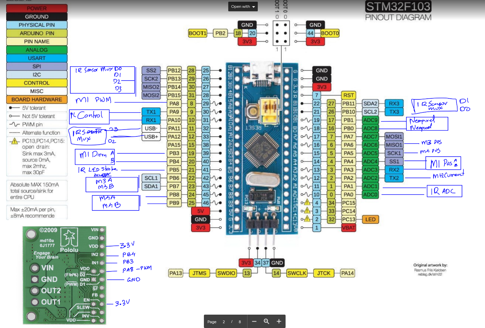

# RollFinger
 - noir branch has no feedback from IR sensors
 ## Requirements
  - Control Gripper open and close motors

    - 2 Motors - M1 & M2 ( connected in opposite, controlled by a single motor driver)
    - PWM Controlled dc brushed
    - Control opening & closing speed
    - Control closing force using motor current estimation
    - M1+M2 motor contro speed on PA8 (PWM)
    - M1+M2 motor control Direction A on PB3
    - M1+M2 motor control Direction b on PB4
    - M1 position feedback on ADC3
    - M2 position feedback on ADC4
    - M1+M2 current feedback on ADC2
    - stop the motor by disconnecting H bridge ( to move by hand)
    - brake the motors by shorting the H bridge ( to hold position)

 - Control Finger Motors
         
    - 2 Motors - M3 & M4, connected to two independent motor drivers
    - PWM controlled DC brushed
    - position control mode for each motor (using PID)
    - velocity control mode for each motor ( not closed loop now, TODO)
    - M3 motor control Direction A on PB6 (PWM)
    - M3 motor control Direction B on PB7 (PWM)
    - M4 motor control Direction A on PB8 (PWM)
    - M4 motor control Direction B on PB9 (PWM)
    - M3 position feedback on ADC6
    - M4 Position feedback on ADC5
    - stop the motor by disconnecting H bridge ( to move by hand)
    - brake the motors by shorting the H bridge ( to hold position)

 - Send the following data to PC over UART at 100 Hz

    - position of M1, M2, M3, M4 
    - motor currents of M1+M2
    - ADC values of 10+10=20 proximity fingers on Finger1 & Finger 2. The ADC values are sampled by ADC0 & ADC1. 10 proximity sensors are connected to an analog mux controlled by following pins. 
        - ADC0 Mux D0 on PB12
        - ADC0 Mux D1 on PB13
        - ADC0 Mux D2 on PB14
        - ADC0 Mux D3 on PB14
        - ADC1 Mux D0 on PB10
        - ADC1 Mux D1 on PB11
        - ADC1 Mux D2 on PA12
        - ADC1 Mux D3 on PA11

 
 - Receive control commands from PC over UART.
    - 8N1, 115200 baud, no newline, no carriage return.
	-   The following are the commands
        -   cop000e - open finger
	    -   cosXXXe -  open finger with XXX speed
	    -   ccpXXXe - close finger with position hold, XXX current threshold    
        -	cccXXXe - close finger with current hold
	    -	ccsXXXe - close finger with XXX speed
	    -   clpXXXe - left finger position roll
	    -   clfXXXe - move left finger forward with XXX speed
	    -   clrXXXe - move left finger reverse with XXX speed
	    -   crpXXXe - right finger position roll
	    -   crfXXXe - move right finger forward with XXX speed
	    -   crrXXXe - move right finger reverse with XXX speed
	    -   csl000e - stop left finger
	    -   csr000e - stop right finger
	    -   csg000e - stop gripper
        -   csXXXXe - stop all
	   	-   cbl000e - brake left finger
	    -   cbr000e - brake right finger
	    -   cbg000e - brake gripper
	   	-   cbXXXXe - brake all
 
 - Control Neopixel RGB leds
    - WS2812 RGB LEDs
    - 24 RGB LEDs on Finger 1, connected to PB0
    - 19 RGB LEDs on Finger 2, connected to PB1
    - have to control individual R, G, B intensity values of all 24+19 LEDs

 ## Hardware
 - Built around BluePill board based on STM32F103
 - a 16 channel analog mux based on CD74HC4076, [breakout board](https://robu.in/product/cd74hc4067-high-speed-%E2%80%8B%E2%80%8Bcmos-16-channel-analogdigital-multiplexer-breakout-module/), to read from 20 IR proximity sensors
 - Proximity sensors used - TCTR5000
 - Motor Driver for M1+M2 - [Pololu MC33926](https://www.pololu.com/product/1212)
 - Motor driver for M3, M4 - [A4953](http://fab.cba.mit.edu/classes/863.13/people/carney/p5/A4952-3-Datasheet.pdf)
 - PB5 used to strobe IR LEDs on the proximity sensor (through a power transistor). This is used to account for the ambient light / sunlight.
 

 ## Software
 Developed in MXCube, uses CMSIS FreeRTOS

 - TIMER1: channel1 is used for PWM control of M1+M2
 - TIMER2: channel1, channel 2 is used for setting WS2812 Neopixel (in`ws2812_led.h` and `ws2812_led.c`)
 - TIMER4: channel1, channel2, channel3, channel4 are used for PWM control of M3 and M4
 - WS2812 Neopixels uses DMA to set LED R,G,B values 
 - ADC uses DMA to continuously sample all analog values and stores it in `adc_value` buffer
 - Binary Semaphone `BinSem` is used to avoid race conditions/conflicts when setting motor directions
 - Two `osTimers` Tasks
     - `pid_timer` runs at 100Hz. This is the PID loop for position control of motors
     - `status_update_timer` runs at 100Hz. This sends data over UART at 100Hz
 - `myQueue01` is used to pass data from UART interrupt (`LL_USART1_IRQHandler`) to UART command parser (defined in `serial_reader_task`)
 - Two `osThread` tasks
     - `adc_reader_task` which strobes the IR LED, operate MUX0 and MUX1 and fills the IR proximity sensor data buffers (`irdata_fl` and `irdata_fr` for right and left fingers)
     - `serial_reader_task` which parses the serial commands send over UART and sets control flags